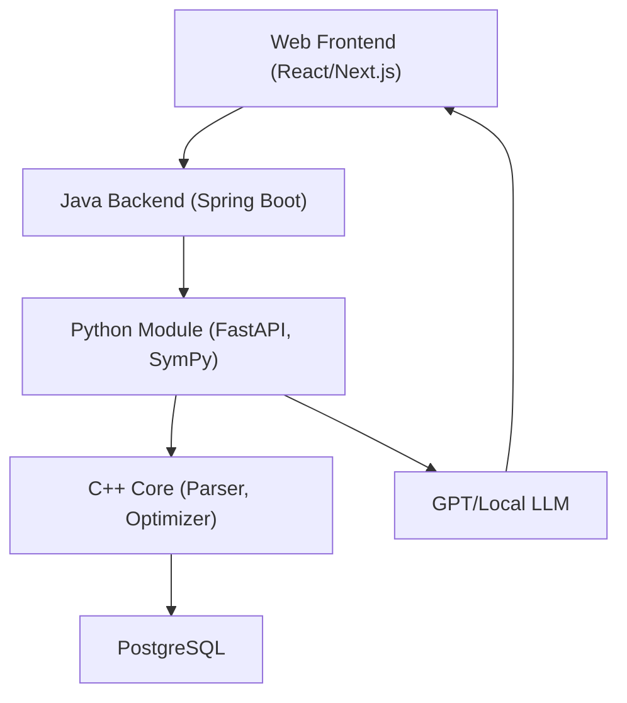

# SymbolMind – The Hybrid AI Math System

> ⚠️ **Concept Only:** This project is currently an idea/prototype and not yet implemented.
>
> 🤖 *Imagine PingMeLater—but for symbolic math! Notifications on derivations and simplifications coming soon.*  

* * *

### Tech Stack

> ⚠️ **Provisional:** This tech stack is conceptual and needs validation for practical feasibility.

| Layer          | Technologies                                 |
|----------------|----------------------------------------------|
| **Backend**    | Java 11+, Spring Boot, Maven, JBoss          |
| **AI Module**  | Python 3.8+, FastAPI, SymPy, pybind11        |
| **Compute**    | C++11 (Parser & Optimizer modules)           |
| **Database**   | PostgreSQL                                   |
| **APIs**       | REST/JSON, optional gRPC                     |
| **Deployment** | Docker, Kubernetes (Helm), Terraform         |
| **CI/CD**      | GitHub Actions                               |
| **Monitoring** | ELK / Loki, Jaeger, Prometheus & Grafana     |
| **Security**   | Keycloak/OAuth2, AES-256 at-rest, TLS 1.3, SAST/DAST |

* * *

### Getting Started

> _This project is currently in the design phase. Code modules and setup instructions will be provided soon!_

* * *

### Roadmap: Three Parallel Paths

1. **Proof-of-Concept**  
   - Symbolic derivation & simplification demo (LaTeX output)  
   - Python–Java integration and basic data persistence  
2. **Community Building**  
   - GitHub project, blog posts, biweekly insights  
   - Online workshops and expert networking  
3. **Product Development**  
   - MVP: Math-GPT tutor with web interface  
   - User feedback loops (lecturers, students)  
   - Launch landing page and pursue funding (EXIST, Prototype Fund)  

* * *

### Feedback & Next Steps

This is a concept in progress. We'd love to hear your thoughts and suggestions:

1. Open an issue to share feedback or ideas  
2. Star the repo to stay updated  
3. Follow the project for upcoming milestones

---

### License

Licensed under the MIT License. See the [LICENSE](LICENSE) file for details.

https://philipppatrickbeck.github.io/PingMeLater/personalMotivation.html

